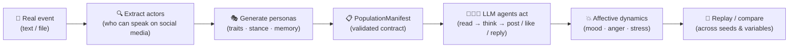

<p align="center">
  
  
  
  
  
  
</p>

<p align="center"><b>English</b> · <a href="README.zh-CN.md">中文</a></p>

<h1 align="center">🌍 Worldline Social</h1>

<p align="center"><b>From one real-world event to a thousand possible futures.</b></p>

<p align="center">
  Paste a real public-opinion event. Worldline Social extracts the actors who can
  actually speak on social media, infers their <b>personalities, stances, interests and
  memories</b>, spawns them into a deterministic digital society, and lets them argue,
  post, like, and react — while their <b>moods shift with every interaction</b>.
  Same event. Different seeds. A whole space of possible futures.
</p>

---

## ✨ Why Worldline Social?

Public opinion is not one story — it is a distribution of plausible stories. Most
simulators give you a single run and call it a prediction. Worldline Social gives you
a **reproducible laboratory** for the space of what could happen:

- ⚡ **Event → simulation, fully automated** — `worldline-social generate-manifest event.txt population.json` extracts the actors (people, media, institutions, governments), generates personas with Big Five + dark-triad traits, stances, interests and event memories, and seeds the world with the event's spark as its first post.
- 🧠 **Personality actually matters** — every agent's persona, stance, and live emotional state is rendered into its LLM context every turn. Neurotic people overreact; psychopathic profiles shrug off criticism; agreeable people light up at approval.
- 💥 **Emotions are a causal system** — posting, being liked, disliked, or replied to shifts mood, anger, stress and threat, modulated by traits. Watch outrage build, fatigue accumulate, and opinions collide over ticks.
- 🌌 **One event, many worldlines** — every run emits a `worldline_manifest` event pinning everything that defines it (population hash, model, prompts, policies); the seed is only the random-stream parameter, and deterministic scheduling keeps each run byte-level replayable. Compare many worldlines to find what doesn't change — that is the data.
- 🔁 **Pause, resume, replay** — checkpoints and event trails on SQLite make long experiments resumable and every moment re-examinable.

> 🦋 **We do not predict the future. We rehearse many.** Run the same event with
> different seeds, swap a rule, inject a variable — and see where the world goes.

## 🪞 Epistemic status

Read this before reading any result. Worldline Social samples **the LLM's folk
sociology, not real societies**: personas are generated by the model, behavior is
performed by the same model family, and emotional dynamics are explicit formulas
we chose. Outputs are **hypotheses and rehearsals, not predictions**, and every
result is model-relative — which is exactly what each run's `worldline_manifest`
event pins down. Treat simulations as a reproducible laboratory for structured
social thought experiments; the road from here to claims about real public
opinion goes through validation (see the roadmap).

## 🏗️ Pipeline



Built on [Worldline Engine](https://github.com/Lecheeel/worldline-engine), which owns
the deterministic timeline; Social owns the people, the platforms, the emotions and the
experiments.

## 🚀 Quick Start

```powershell
# install the engine first, then social
python -m pip install -e ..\worldline-engine
python -m pip install -e .

# run the scripted example (no LLM required)
worldline-social validate-population examples\population.json
worldline-social run examples\experiment.json
```

### From a real event to a simulated society

```powershell
# 1. generate a population from an event (requires DEEPSEEK_API_KEY)
worldline-social generate-manifest event.txt population.json

# 2. run an LLM-driven experiment (see examples/experiment_llm.json)
worldline-social run experiment.json
```

Or run the full loop in one command with [examples/event_to_simulation.py](examples/event_to_simulation.py):

```powershell
python examples\event_to_simulation.py event.txt --ticks 5 --seed 0
```

Each `--seed` is one worldline. Run it with seeds `0..N` and compare the futures.

## 🧪 What You Can Explore

- **Outrage dynamics** — how does a single controversial post cascade into anger across a network?
- **Echo chambers** — replace the feed policy and watch opinion clusters diverge.
- **Personality × platform** — the same event, the same people, different traits: what breaks differently?
- **Intervention experiments** — inject a variable at tick 3 on one worldline, keep the control (same manifest, exactly one field changed), compare. A seed-only rerun is the null baseline, not an intervention.

## 🗺️ Roadmap

- [ ] Local knowledge-graph memory (GraphRAG on SQLite, no cloud)
- [ ] Dynamic memory: agents write what they experienced, recall it, act on it
- [ ] Batch worldline exploration: stability across seeds at each tick, divergence curves over time, attractor clustering of final states
- [ ] Stylized-facts validation: compare simulation statistics (outrage cascade half-life, reply-chain depth, stance clustering) against published public-opinion datasets
- [ ] Probe any agent: ask the simulated world what it thinks

## 🤝 Contributing

PRs are welcome! Please follow [Conventional Commits](https://www.conventionalcommits.org/).
Bugs, ideas and experiments → [Issues](https://github.com/Lecheeel/worldline-social/issues).

## 📄 License

Apache License 2.0, matching [Worldline Engine](https://github.com/Lecheeel/worldline-engine). See [LICENSE](LICENSE).
