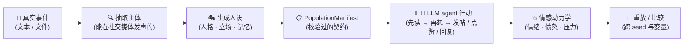

<p align="center">
  
  
  
  
  
  
</p>

<p align="center"><a href="README.md">English</a> · <b>中文</b></p>

<h1 align="center">🌍 Worldline Social</h1>

<p align="center"><b>从一个真实事件，到一千种可能的未来。</b></p>

<p align="center">
  粘贴一条真实的舆论事件。Worldline Social 会提取其中所有"真正能在社交媒体发声"的主体，
  推断他们的<b>人格、立场、兴趣与记忆</b>，把他们放进一个确定性的数字社会里，让他们
  争论、发帖、点赞、回应——而他们的<b>情绪会随着每一次互动真实地变化</b>。
  同一个事件，不同的 seed，一整片可能性的空间。
</p>

---

## ✨ 为什么是 Worldline Social？

舆论从来不是单一故事，而是一组"讲得通的故事"的分布。多数模拟器给你跑一次，然后管那叫预测。
Worldline Social 给你的是一个**可复现的实验场**，用来研究"可能发生什么"的空间：

- ⚡ **事件 → 模拟，全自动** —— `worldline-social generate-manifest event.txt population.json` 一行命令：抽取主体（个人、媒体、机构、政府），生成带大五人格 + 暗黑三角、立场、兴趣与事件记忆的人设，并把事件的引爆点作为世界的第一条帖子。
- 🧠 **人格真的起作用** —— 每个 agent 的人设、立场和实时情绪状态每一轮都被渲染进它的 LLM 上下文。神经质的人反应过度；精神病态的人对批评无动于衷；宜人性高的人因被认可而雀跃。
- 💥 **情绪是因果系统** —— 发帖、被赞、被踩、被回复，都会改变 mood、anger、stress、threat，且受人格调制。观察愤怒如何累积、疲劳如何堆积、观点如何在 tick 之间碰撞。
- 🌌 **一个事件，多条世界线** —— 每次运行都会发出一条 `worldline_manifest` 事件，钉住定义它的一切（人口哈希、模型、Prompt、策略）；seed 只是随机流参数，确定性调度让每次运行逐字节可重放。比较许多条世界线，找出什么不变——这才是数据。
- 🔁 **暂停、恢复、重放** —— SQLite 上的 checkpoint 与事件轨迹让长实验可续跑，让每个时刻可复查。

> 🦋 **我们不预测未来，我们排练许多个未来。** 用不同的 seed 跑同一个事件，换一条规则，
> 注入一个变量——然后看看世界会走向哪里。

## 🪞 认识论声明

在读任何结果之前，请先读这一节。Worldline Social 采样的是 **LLM 的民间社会学，
不是真实社会**：人设由模型生成，行为由同一模型家族扮演，情绪动力学是我们选定的
显式公式。输出是**假设与排练，不是预测**；每个结论都相对于模型成立——这正是
每次运行的 `worldline_manifest` 事件所钉住的内容。请把模拟当作结构化社会思想实验
的可复现实验室；从这里走到"关于真实舆论的断言"，中间隔着验证（见路线图）。

## 🏗️ 流水线



建立在 [Worldline Engine](https://github.com/Lecheeel/worldline-engine) 之上：
引擎拥有确定性的时间线，Social 拥有人民、平台、情绪与实验。

## 🚀 快速开始

```powershell
# 先安装 Engine，再安装 Social
python -m pip install -e ..\worldline-engine
python -m pip install -e .

# 运行剧本式示例（无需 LLM）
worldline-social validate-population examples\population.json
worldline-social run examples\experiment.json
```

### 从真实事件到模拟社会

```powershell
# 1. 从事件生成人口清单（需要 DEEPSEEK_API_KEY）
worldline-social generate-manifest event.txt population.json

# 2. 运行 LLM 驱动的实验（见 examples/experiment_llm.json）
worldline-social run experiment.json
```

或者用 [examples/event_to_simulation.py](examples/event_to_simulation.py) 一条命令跑完整个闭环：

```powershell
python examples\event_to_simulation.py event.txt --ticks 5 --seed 0
```

每个 `--seed` 是一条世界线。用 `0..N` 的 seed 跑 N 次，然后比较这些未来。

## 🧪 你可以探索什么

- **愤怒动力学** —— 一条有争议的帖子如何在网络中级联成愤怒？
- **回音室** —— 换一种 feed 策略，观察观点群体如何分化。
- **人格 × 平台** —— 同一个事件、同一群人、不同的人格：哪里先崩？
- **干预实验** —— 在某条世界线的第 3 tick 注入一个变量，保留对照组（同 manifest、只差一个字段），然后比较。只换 seed 重跑是零基线，不是干预。

## 🗺️ 路线图

- [ ] 本地知识图谱记忆（SQLite 上的 GraphRAG，不依赖云）
- [ ] 动态记忆：agent 写下经历、召回它、并据此行动
- [ ] 批量世界线探索：每个 tick 上跨 seed 的稳定性、发散随时间的曲线、终态的吸引子聚类
- [ ] Stylized-facts 验证：把模拟统计量（愤怒级联半衰期、回复链深度、立场聚类）与已发表的舆情数据集对齐
- [ ] 探查任意 agent：直接问模拟世界它在想什么

## 🤝 参与贡献

欢迎 PR！请遵循 [Conventional Commits](https://www.conventionalcommits.org/)。
Bug、想法与实验 → [Issues](https://github.com/Lecheeel/worldline-social/issues)。

## 📄 License

Apache License 2.0，与 [Worldline Engine](https://github.com/Lecheeel/worldline-engine) 一致。
详见 [LICENSE](LICENSE)。
